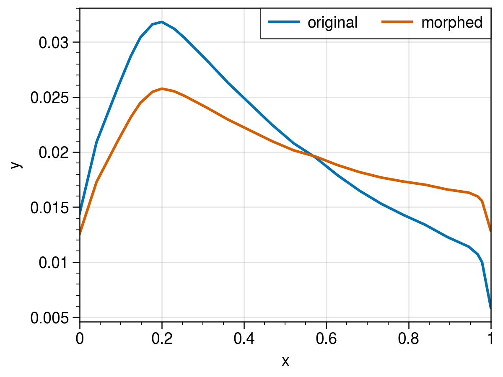

# Morph 1D

Small package to morph 1D functions using radial basis function (RBF).

Based on [PyGeM](https://github.com/mathLab/PyGeM) developed by SISSA mathLab.


## Example

See [example.py](example.py):

```python
# Define # control points
n_points = 4

# Define the amount to morph
dy = np.random.rand(n_points) * 0.4 - 0.2

# Morph!
x_morphed, y_morphed = morph(x, y, dy, relative=True)
```

</img>